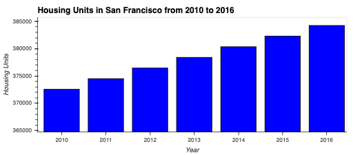

# San Francisco Housing Analysis

Proptech, the application of technology to real-estate markets, is an innovative domain in the fintech industry. I an analyst at a proptech company that wants to offer an instant, one-click service for people to buy properties and then rent them. The company wants to have a trial of this offering in the San Francisco real-estate market. If the service proves popular, they can then expand to other markets.

My main goal is finding properties in the San Francisco market that are viable investment opportunities.

---

## Technologies

This project was developed with python 3.7 with the following packages:

* [pandas](https://github.com/pandas-dev/pandas) - Providing fast, flexible, and expressive data structures designed to make working with "relational" or "labeled" data both easy and intuitive.

* [HoloViz (formerly PyViz)](https://pypi.org/project/hvplot/) - Data visualization tools hvPlot and GeoView.

* [pathlib] (https://docs.python.org/3/library/pathlib.html) - This module allows to easily read in csv files.

And as well I used [Jupyter Lab](https://github.com/jupyter/notebook) notebook to develope it.

---

## Installation Guide

Before running the application it is necessary to install the following dependencies.

* pandas
```conda install pandas``` 
* pathlib
```pip install pathlib```
* Jupyter Notebook
```pip install notebook```
* hvplot
```conda install -c pyviz hvplot```

---
## Usage

To use the application you will need to clone the repo into your machine, navigate on terminal into it and open your [Jupyter Lab](https://github.com/jupyter/notebook) to run the file **san_francisco_housing.ipynb**. 

Bellow you can find a brief summary of the data collected through the analysis.

  |  
  |  
---

## Contributors

This was a project developed as a group during a Fintech Bootcamp hosted by UC Berkley Extension. 

---

## License
MIT


HAPPY CODING :) 
